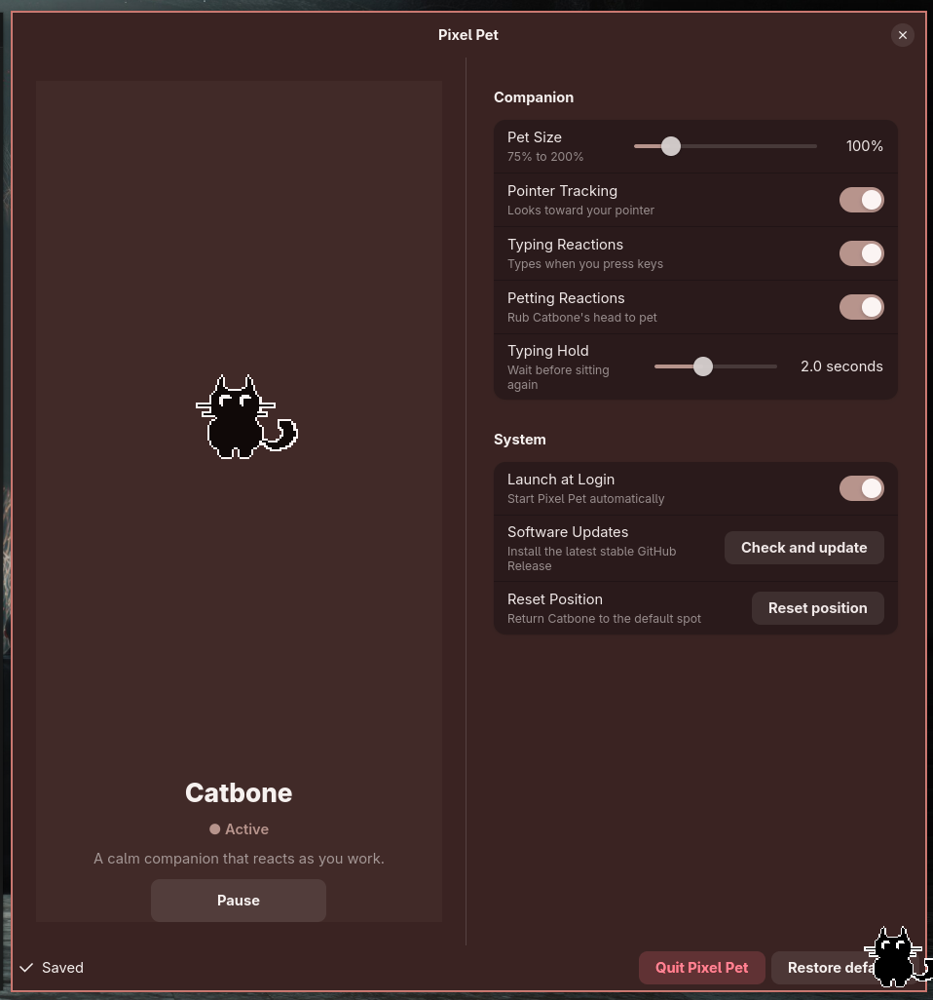
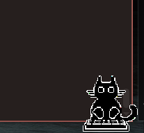
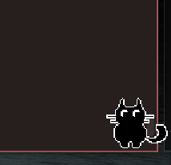

# Pixel Pet

Pixel Pet is a pixel-art desktop companion for Wayland. Catbone lives in a
transparent screen overlay, looks toward the pointer, reacts to typing, and can
be dragged anywhere on screen.

The GTK4/Libadwaita Pet Controller provides live configuration without command
line flags or environment variables.

## Screenshots



| Typing reaction | Pointer tracking |
| --- | --- |
|  |  |

## Install

Install the latest stable GitHub Release for the current user with one command:

```bash
curl -fsSL https://raw.githubusercontent.com/selfAnnihilator/pixel-pet/master/scripts/install-release.sh | sh
```

When working from a cloned checkout, install that checkout with:

```bash
./scripts/install.sh
```

Pixel Pet then appears in your desktop app launcher and can also be started
with `pixel-pet` when `~/.local/bin` is on `PATH`. Run the same command again
to update an existing installation from the current checkout. No root access
is required. If Pixel Pet is already running during an update, quit and
relaunch it afterward; the single running instance does not reload files in
place.

List all installed-app commands:

```bash
pixel-pet --help
```

Check for or install stable updates from a terminal:

```bash
pixel-pet update --check
pixel-pet update
```

The Pet Controller also has **Check and update** under **System**. Update checks
run outside the GTK thread. Relaunch Pixel Pet after an installed update.

Uninstall the application, launcher, icon, and autostart entry:

```bash
pixel-pet uninstall
```

Uninstall preserves settings in `~/.config/pixel-pet`. Remove settings too:

```bash
pixel-pet uninstall --purge
```

## Run

```bash
./run-pet.sh
```

The first launch opens the Pet Controller and starts Catbone. Closing the
controller keeps the companion running. Run `./run-pet.sh` again to reopen the
existing controller. Use **Quit Pixel Pet** to stop both.

Start without opening the controller:

```bash
./run-pet.sh --background
```

Stop the installed app from a terminal like other desktop applications:

```bash
pkill -x pixel-pet
```

Pixel Pet sets its Linux process name to `pixel-pet`; the Python interpreter
name is not exposed as its process identity.

## Settings

- Pet size from 75% to 200%
- Pointer tracking
- Typing reactions
- Petting reactions
- Typing Hold from 0 to 5 seconds
- Pause or resume
- Reset screen position
- Launch at login through XDG autostart
- Restore defaults

Settings apply immediately and persist in:

```text
${XDG_CONFIG_HOME:-~/.config}/pixel-pet/settings.json
```

## Requirements

- Python 3
- GTK4 and PyGObject
- Libadwaita 1
- gtk4-layer-shell
- A wlroots Wayland compositor such as niri, sway, or Hyprland

`run-pet.sh` locates and preloads `libgtk4-layer-shell.so` before starting the
app.

### Global input access

Pointer tracking and typing reactions read Linux evdev devices so the overlay
never needs keyboard focus. Your account must be able to read `/dev/input`.

The controller detects missing access and provides this setup command:

```bash
sudo usermod -aG input "$USER"
```

Sign out and back in after changing group membership, then select **Recheck**.
Pixel Pet never runs `sudo` itself.

## Behavior

Catbone is a stationary companion: it stays wherever you place it and never
walks or roams on its own.

- **Pointer tracking:** Catbone looks toward the pointer using nine directional
  poses, then returns to its normal forward-facing sitting pose.
- **Typing:** Every physical key press counts, including modifiers and function
  keys. Catbone types while sitting and alternates paws with successive presses.
  Holding a key holds the matching pressed-paw pose. After the last release,
  Catbone waits in its ready pose for the configured Typing Hold duration.
- **Petting:** Press Catbone's head and rub left and right while holding the
  mouse button. Catbone closes its eyes, gently wiggles with the movement, and
  continuously floats up to three small pixel hearts. Releasing leaves the
  relaxed pose briefly before normal behavior resumes.
- **Positioning:** Press and drag Catbone's body to move it. The head is reserved
  for petting when Petting Reactions are enabled; disabling them makes the whole
  body draggable.
- **Activity priority:** Hiding, dragging, petting, and active typing take
  priority over passive tracking and hold poses, so a new action responds
  immediately instead of waiting for the previous reaction to finish.
- **Visibility:** Pausing the pet or entering a fullscreen app temporarily hides
  it without losing its saved position.
- **Silence:** Pixel Pet has no voice, music, or sound effects.

## Project layout

- `pet.py`: overlay runtime, input tracking, and application lifecycle
- `pet_controller.py`: GTK4/Libadwaita Pet Controller
- `pet_settings.py`: persistent settings and XDG autostart
- `assets/catbone/`: tracking, drag, and typing sprite sheets
- `PRODUCT.md` / `DESIGN.md`: product and visual direction
- `CONTEXT.md`: canonical behavior language
- `context.md`: implementation history and operational notes

## Credits

Cat artwork includes assets derived from work by Artoellie. Check the artist's
license before redistributing art.

## License

Code: MIT. Art: © Artoellie, per the artist's terms.
