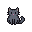
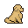

# Pixel Pet

A pixel-art desktop companion (comnyang-style) that lives on your screen. It walks toward
your cursor, perks up when you type, idles with little ambient motions, and nudges you to
take stretch breaks. Two pets, switchable from the tray: a grey **cat** and **Goldie** the
golden-retriever puppy.

 

## Run

```bash
npm install
npm run gen:assets   # build sprite sheets + manifest from the source art (see below)
npm start            # launch the pet
```

The pet sits in the bottom-right by default. Drag it anywhere (it remembers the spot).
Everything else is in the **tray menu**: pick the pet (Cat / Goldie), size (3×–6×),
stretch-break interval, pause, "Stretch now", and Quit.

## Features

- **Cursor following** — walks and faces toward the pointer when it strays far, idles when near.
- **Keystroke reactions** — global keydown (anywhere, not just this window) triggers a perk-up.
- **Idle motions** — weighted cycle of sit/groom/sleep.
- **Stretch breaks** — every N minutes (default 30) it plays a stretch + a speech bubble.
- **Click-through** — the window is transparent and ignores the mouse *except* over the sprite,
  so it never gets in the way of your other apps.

## Linux portability

The pet needs three things a desktop normally guards: **always-on-top**, **show on every
workspace**, and **global cursor/keystroke**. The portable way to get them is to run on
**X11 / XWayland** (forced via `ozone-platform-hint=x11`) and set standard **EWMH** window
hints (`_NET_WM_STATE_ABOVE`, `_NET_WM_STATE_STICKY`, skip-taskbar). `npm start` exports
`ELECTRON_OZONE_PLATFORM_HINT=x11` for you.

| Environment | How the overlay stays on top / on all workspaces |
|---|---|
| X11 WMs (i3, bspwm, …), GNOME, KDE, Xfce, Cinnamon, MATE | EWMH hints — works out of the box, no helper |
| **sway** | native `floating enable, sticky enable` applied via `swaymsg` |
| **Hyprland** | native `float` + `pin` applied via `hyprctl` |
| **niri** | no native sticky rule → app floats the window and follows the active workspace over `niri msg event-stream` |

The compositor glue lives in `src/main/wm.js`; it's detected by env var and degrades to a
no-op (EWMH-only) if the compositor or its CLI is unknown.

**Transparency:** Chromium needs an ARGB visual or the overlay paints a solid black box;
the app passes `--enable-transparent-visuals` to avoid that on XWayland.

If global keystroke reactions don't fire, you're on pure Wayland without XWayland — the pet
still works, it just won't see keystrokes typed in *other* windows (Wayland blocks global
input for regular clients; only XWayland apps are visible to it).

### Optional: set a float rule yourself

The app applies these automatically, but if you prefer a static rule:

- **i3:** `for_window [title="PixelPet"] floating enable, sticky enable, border none`
- **sway:** `for_window [title="PixelPet"] floating enable, sticky enable, border none`
- **Hyprland:** `windowrulev2 = float,title:^(PixelPet)$` + `windowrulev2 = pin,title:^(PixelPet)$`
- **niri:** `window-rule { match title="^PixelPet$"; open-floating true; }`

Debian/Ubuntu runtime deps: `libx11-6 libxtst6 libxkbcommon0` (declared in the `.deb`).

## Add your own art

The source sheets have no frame-tag metadata, so `gen:assets` **auto-segments** them:
blank horizontal rows split a sheet into animation *strips*; blank vertical columns split a
strip into *frames*. Each frame is tight-cropped and repacked into a uniform,
bottom-center-anchored grid.

To add a pet:

1. Drop its sprite sheet into `assets/src/<your pack>/`.
2. Add an entry to the `PETS` map in `tools/gen-assets.js` — map each engine animation
   (`idle`, `walk`, `sleep`, `stretch`, `react`, `groom`) to a **strip index** on the sheet,
   and set `facesRight`.
3. `npm run gen:assets` then `npm start`.

`gen:assets` extracts the original packs from `~/Documents` (`Free pack.zip`,
`Goldie pack_v1.1.zip`) on first run. The generated `assets/*/*.png` + `assets/manifest.json`
are what the app ships; `assets/src/` is source only and is excluded from packaged builds.

## Package

```bash
npm run dist:linux   # AppImage + deb
npm run dist:win     # nsis installer
```

Config: `electron-builder.yml`. `uiohook-napi` ships prebuilt native binaries for Linux and
Windows. Cross-building the Windows installer from Linux needs Wine — a Windows host or CI is
the clean path.

## Credits

Pixel art by **Artoellie** ([itch.io](https://artoellie.itch.io/)) — the "Free pack" cat and
"Goldie" golden-retriever pack. Please keep this attribution and check the artist's license
before redistributing the art.

## License

Code: MIT. Art: © Artoellie, per the artist's own terms.
